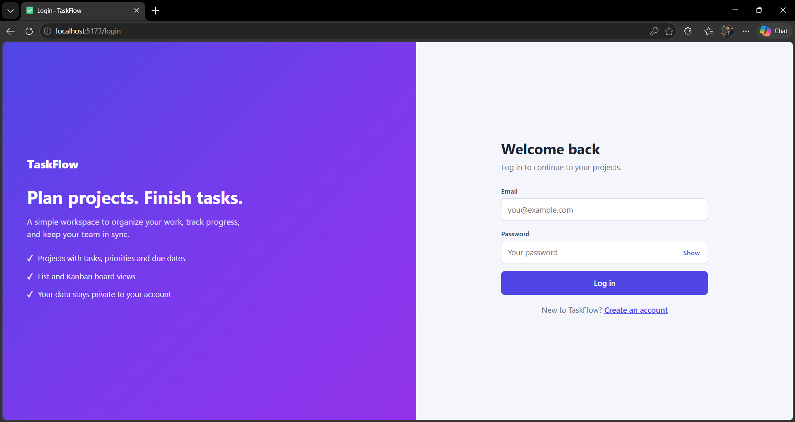
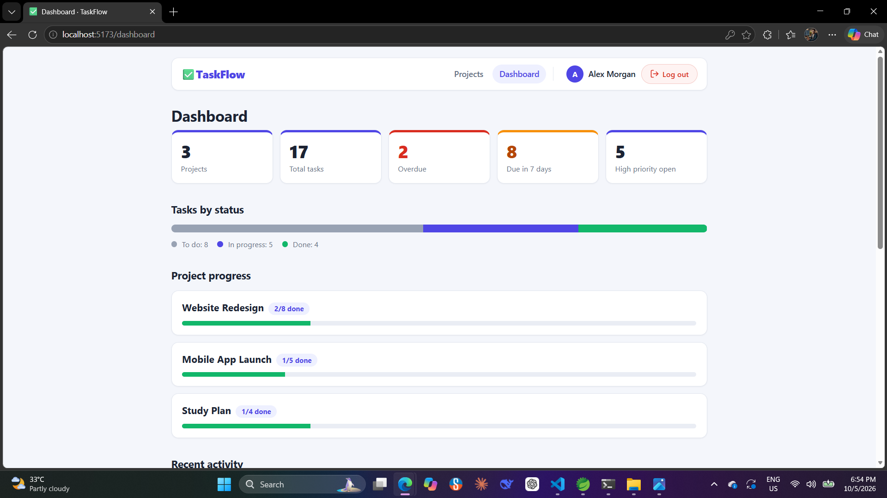
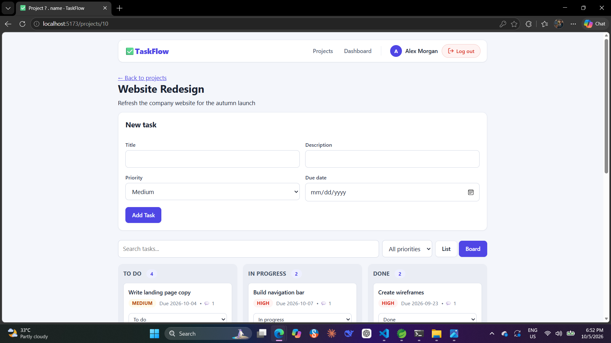

# TaskFlow (Frontend)


React single-page app for TaskFlow, a project and task manager.
Backend repository: https://github.com/rahul-chauhan-dev/taskflow-backend





## Features
- Register and log in, with protected routes
- Projects and tasks with search, filters, sorting and pagination
- Kanban board with drag and drop
- Task comments and a statistics dashboard
- Form validation with server-side error messages

## Tech stack
React, React Router, Vite, plain CSS

## Run locally
```bash
npm install
cp .env.example .env    # set VITE_API_URL if the backend is not on localhost:8080
npm run dev
```
Open http://localhost:5173. The backend must be running.

## Build
```bash
npm run build
```